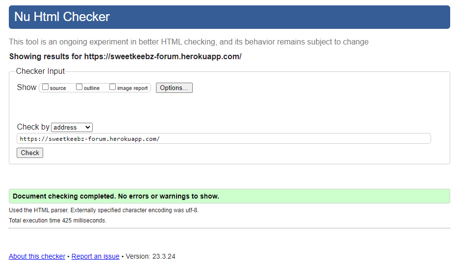
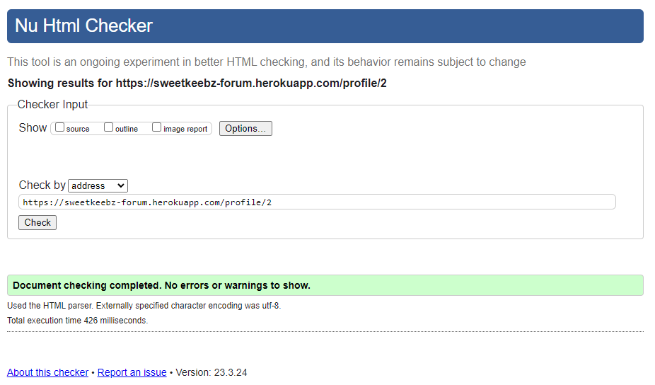
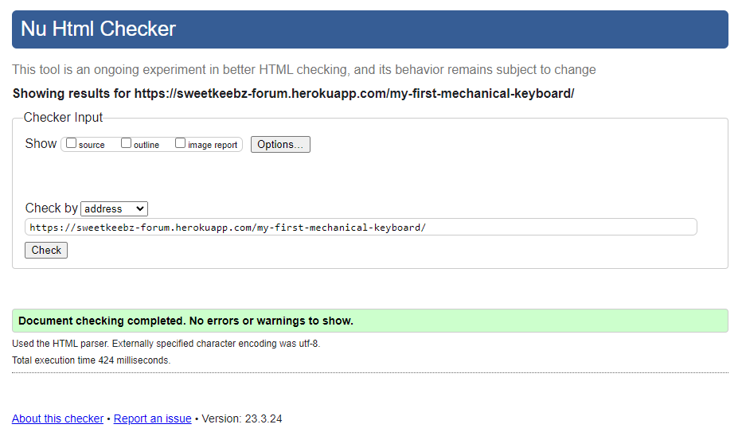
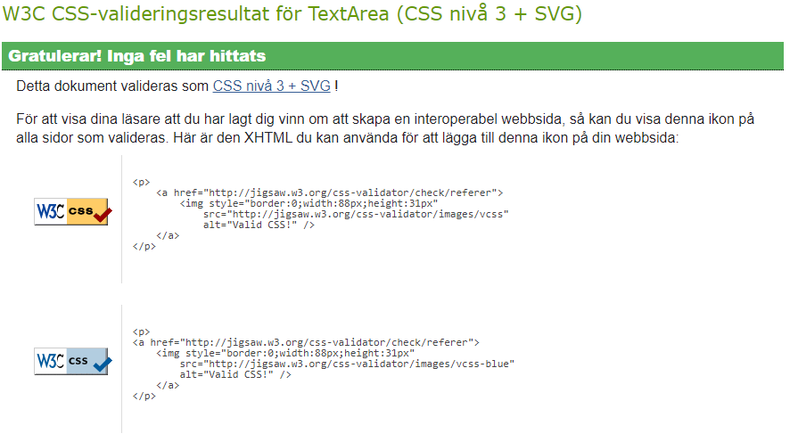
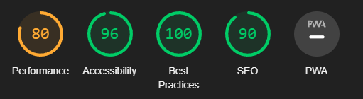

# Sweetkeebz Forum Testing

## Automated Testing

HTML was validated using the W3C Markup Validation Sevice

Css was validated using W3C Jigsaw

Responsiveness was tested using Chrome Lighthouse

## Manual Testing

### Testing User Stories

| Goals | How are they achieved? | Image |
| :--- | :--- | :--- |
| `Users` |
| Users should be able to enter the forum and view other users posts in order to get information. | Users can enter the initial listview even if they aren't logged in and view posts |  |
| Users should be able to create an account nad log in. | Users can login or sign up if they press the login button on the navbar, an outlogged user will be redirected to the login page if he/she is trying to interact with a post | |
| Users should be able to upvote posts. | Users can upvote a post by pressing the upvote button either in the list view or inside the full post  | |
| Users should be able to downvote posts | Users can downvote a post by pressing the downvote button either in the list view or inside the full post | |
| Users should be able to comment on posts | Users can comment on posts by going inside the full post and filling out the comment form | |
| Users should be able to edit posts | Users are able to edit their own posts by clicking the edit button accessed by clicking the three dot icon above their own posts| |
| Users should be able to delete posts | Users are able to delete their own posts by clicking the edit button accessed by clicking the three dot icon above their own posts | |
| Users should be able to edit comments | Users are able to edit their own comments by clicking the edit button accessed by clicking the three dot icon above their own comments | |
| Users should be able to delete comments | Users are able to delete their own comments by clicking the edit button accessed by clicking the three dot icon above their own comments | |
| Users should be able to personalize their profiles by updating their avatars, usernames and about sections. | Users are able to customize their profile by clicking their profile pictures on their own profile pages. | |
|`Admin`|
| Admin should be able to manage posts by editing and deleting posts and comments made by any user. | Admin is able to access the admin page from where he/she can remove or edit any content made by any user. |  |

### Full testing

Full testing was performed with the following devices

* Personal Computer
    * Acer Predator PO3-620
    * MacBook Pro 2020 
* Mobile device
    * Iphone SE (2022)

Tests were done using the following browsers:
* Microsoft Edge
* Google Chrome
* Safari

| Feature | Expected Outcome | Testing Performed | Result | Pass/Fail |
| :--- | :--- | :--- | :--- | :--- |
| `Navbar` |
| SweetKeebz Logo | When clicked, the user should be redirected back to the home page | Clicked Logo | Redirected to the home page | Pass |
| About Page Link | When clicked, the user should be redirected to the about page | Clicked Link | redirected to the about page | Pass |
| Create Post link | If logged in, it should redirect me to the create post form. Else It sould redirect to login page | Clicked Link | redirected to login page, after logging in and clicking link again, it redirected to the create post page | Pass |
| Login/logout link | If not logged in, link should be labelled 'login' and when clicked, should redirect me to login form. If logged in, link should be labelled 'logout' and should redirect me to logout page | Clicked Link | When logged out, link was labelled 'login' and redirected to the login page. When logged, link was labelled 'logout' and redirected to the logout page | Pass |
| Profile Page Link | When clicked, it should redirect to the logged in users profile page | Clicked Link | Link redirected to the logged in users profile page. | Pass |
| Notifications Link | When clicked, it should redirect to the notifications page | Clicked Link | redirected to the notifications page | Pass |
| Notification alert | When user has an unread notification, a blue dot will appear next to the notification link. | created comment on post that belonged to user | Blue dot appeared next to notification link | Pass |
| `Footer` |
| Twitter Link | When clicked should open Twitter in a new tab | Clicked Link | Redirected to Twitter in a new tab | Pass |
| Facebook Link | When clicked should open Facebook in a new tab | Clicked Link | Redirected to Facebook in a new tab | Pass |
| Github Link | When clicked should open Github in a new tab | Clicked Link | Redirected to Github in a new tab | Pass |
| `Home Page` |
| Post Link | When a post is clicked, it should redirect you to the full post | Clicked Post | Redirected to the full post | Pass |
| Comment Button | When clicked, it should redirect you to the full post | clicked Button | Redirected to the full post | Pass |
| Upvote Button | When clicked, it should turn blue and add +1 to the vote counter, and clicking again will reverse the action | Clicked Button | Turned blue and added +1 to the counter, clicking again reversed the action | Pass |
| Downvote Button | When clicked, it should turn blue and add -1 to the vote counter, and clicking again will reverse the action | Clicked Button | Turned blue and added -1 to the counter, clicking again reversed the action | Pass |
| Post Author Link | When clicked, it should redirect to the profile of the post author | Clicked Link | Redirected to the authors profile page | Pass |
| Three Dot Button | When clicked, it should generate a dropdown menu with the links 'edit' and 'delete' | Clicked Button | Generated a dropdown menu with the links 'edit' and 'delete' | Pass |
| Edit Link | When clicked, it should redirect to the edit post page which should be filled with the original content  | Clicked Link | Redirected to the edit post page and the form was filled with the original post content | Pass |
| Delete Link | When clicked, it should delete the post entirely | Clicked Link | Deleted post entirely | Pass |
| `Full Post` |
| Upvote Button | When clicked, it should turn blue and add +1 to the vote counter, and clicking again will reverse the action | Clicked button | Turned blue and added +1 to the counter, clicking again reversed the action | Pass |
| Downvote Button | When clicked, it should turn blue and add -1 to the vote counter, and clicking again will reverse the action | Clicked button | Turned blue and added -1 to the counter, clicking again reversed the action | Pass |
| Comment Textarea | Adding Text to the Textarea labelled 'comment' and clicking the 'comment' button should post your comment in the comment section | Add text and click 'comment' | posted the added text as a comment in the comment section | Pass |
| comment author link | when clicked, should redirect to the comment author's profile page | Click Link | Redirected to the comment authors profile page | Pass |
| Three Dot Button | When clicked, it should generate a dropdown menu with the links 'edit' and 'delete' | Clicked Button | Generated a dropdown menu with the links 'edit' and 'delete' | Pass |
| Edit Link | When clicked, it should fill the comment textare with the original content of the comment and it should be editable  | Clicked Link, edited text and clicked save | Redirected to the edit post page and the form was filled with the original post content | Pass |
| Delete Link | When clicked, it should delete the comment entirely | Clicked Link | Deleted comment entirely | Pass |
|`Create Post`|
| Generate Form | Clicking create post should redirect to a form with the fields title, content and image | Click Link | generated a form with the fields Title content and image | Pass |
| Generate Preview | Clicking the image button should let user choose image and generate a preview of chosen image | Click Button | Let user pick an image and preview it | Pass |
| Changeing preview | When a user clicks the image button again and selects another image, the other image should be the one who is posted | Selected 2 different images and pressing post | pressing post uploaded the second image selected | Pass |
| Post Button | Clicking the post button should allow you to post your content to the home page | Click Button | Posted to the home page | Pass |
|`Edit Post`|
| Form Already Filled | When clicking 'edit' on a post the form should be filled out with the original content of the post and should be editable | Click 'Edit' and change content on post | the content is editable | pass |
| Image Swappable | Clicking the image button should allow you to choose and preview a different image from the original | Change Image and click save | image on post changed and was saved | Pass |
| Invalid input | Inputting bad input should display an error message | Enter spaces instead of text | Displayed an error message | Pass |
| Save Button | Clicking the save button should save the changes that you have made to the post | Click Save | Saved changes made to post | Pass |
|`Profile`|
| Profile display | Profile page should display | Click Link | Displayed user profile | Pass |
| Edit Profile | Clicking avatar should redirect to edit profile form | Clicked avatar | Redirected to edit profile form | Pass |
| Post Display | Profile page should display posts made by the profiles owner | Clicked profile link | Displayed posts only belonged to profile | Pass |
|`Edit Profile`|
| Profile Form | Edit profile form should be filled out with original content | Clicked Edit Profile | Form fields were already filled | Pass |
| Avatar Field | Clicking the preview of the avatar should allow you to choose a different profile picture and preview it | Click Avatar | Allowed user to choose a different profile picture and preview it | Pass |
| Save Profile | Clicking the save button should save the changes you made to your profile | clicked save | saved changes made to profile | Pass |
|`Notifications`|
| Notification Sender Link | clicking the notification sender should redirect you to the senders profile | click link | redirected to the senders profile | Pass |
| Notification Post Link | clicking the notification post should redirect you to the post in question | Click link | redirected to correct post | Pass |
| Notification read | Clicking post in notifications should mark that post as read | click post | notification was marked as read | pass |

## Bugs